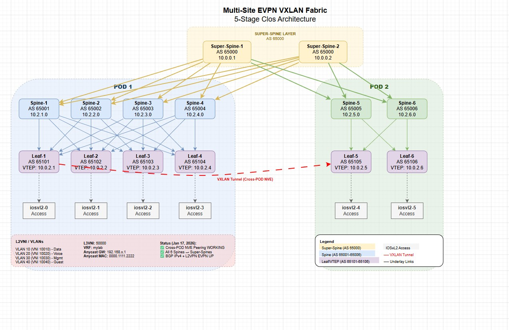

# Cisco Multi-Site EVPN Implementation

A complete **BGP EVPN VXLAN Multi-Site Data Center Fabric** implementation using Cisco CML and AI-assisted automation. This project demonstrates a production-ready 5-stage Clos topology with 2 PODs interconnected via Super-Spines.



## Overview

This repository contains a fully documented implementation of:
- **Multi-Site VXLAN EVPN Fabric** with 2 PODs
- **5-Stage Clos Architecture** (Super-Spine / Spine / Leaf / Access)
- **20 Network Devices** (14 NX-OS 9000v + 6 IOSvL2)
- **eBGP EVPN Overlay** with unique AS per device
- **Anycast Gateway** for distributed default gateway
- **AI-Assisted Configuration** using Claude

## Current Lab Status (January 17, 2026)

| Component | POD 1 | POD 2 | Status |
|-----------|-------|-------|--------|
| Leaf-to-Spine BGP | 4 Spines | 2 Spines | ✅ Working |
| VXLAN NVE VNIs | 5 VNIs Up | 5 VNIs Up | ✅ Working |
| **Cross-POD NVE Peers** | **Sees POD2 Leafs** | **Sees POD1 Leafs** | ✅ **WORKING** |
| Super-Spine BGP (EVPN) | 6 Spines connected | 6 Spines connected | ✅ **WORKING** |
| Super-Spine BGP (IPv4) | 6 Spines (underlay) | 6 Spines (underlay) | ✅ **WORKING** |
| IOSvL2 Trunks | Configured | Configured | ✅ Working |

## Lab Topology

### Architecture: 5-Stage Clos (Multi-Site)

```
                    ┌─────────────────────────────────────┐
                    │         SUPER-SPINE LAYER           │
                    │   Super-Spine-1    Super-Spine-2    │
                    │    (AS 65000)       (AS 65000)      │
                    └───────────┬─────────────┬───────────┘
                                │             │
           ┌────────────────────┴─────────────┴────────────────────┐
           │                                                        │
    ┌──────┴──────┐                                          ┌──────┴──────┐
    │    POD 1    │                                          │    POD 2    │
    ├─────────────┤                                          ├─────────────┤
    │ Spine 1-4   │                                          │ Spine 5-6   │
    │ Leaf 1-4    │                                          │ Leaf 5-6    │
    │ iosvl2 0-3  │                                          │ iosvl2 4-5  │
    └─────────────┘                                          └─────────────┘
```

### Complete Device Inventory

#### NX-OS 9000v Devices (VXLAN EVPN Fabric)

| Device | Role | Management IP | BGP AS | Loopback0 (VTEP) |
|--------|------|---------------|--------|------------------|
| **Super-Spine Layer** |||||
| Super-Spine-1 | Super Spine | 192.168.30.118/24 | 65000 | 10.0.0.1 |
| Super-Spine-2 | Super Spine | 192.168.30.119/24 | 65000 | 10.0.0.2 |
| **POD 1 - Spine Layer** |||||
| Spine-1 | Spine | 192.168.30.110/24 | 65001 | 10.2.1.0 |
| Spine-2 | Spine | 192.168.30.111/24 | 65002 | 10.2.2.0 |
| Spine-3 | Spine | 192.168.30.112/24 | 65003 | 10.2.3.0 |
| Spine-4 | Spine | 192.168.30.113/24 | 65004 | 10.2.4.0 |
| **POD 1 - Leaf Layer** |||||
| Leaf-1 | Leaf/VTEP | 192.168.30.114/24 | 65101 | 10.0.2.1 |
| Leaf-2 | Leaf/VTEP | 192.168.30.115/24 | 65102 | 10.0.2.2 |
| Leaf-3 | Leaf/VTEP | 192.168.30.116/24 | 65103 | 10.0.2.3 |
| Leaf-4 | Leaf/VTEP | 192.168.30.117/24 | 65104 | 10.0.2.4 |
| **POD 2 - Spine Layer** |||||
| Spine-5 | Spine | 192.168.30.122/24 | 65005 | 10.2.5.0 |
| Spine-6 | Spine | 192.168.30.123/24 | 65006 | 10.2.6.0 |
| **POD 2 - Leaf Layer** |||||
| Leaf-5 | Leaf/VTEP | 192.168.30.120/24 | 65105 | 10.0.2.5 |
| Leaf-6 | Leaf/VTEP | 192.168.30.121/24 | 65106 | 10.0.2.6 |

#### IOSvL2 Access Switches

| Device | Role | Management IP | Connected To | VLANs |
|--------|------|---------------|--------------|-------|
| iosvl2-0 | Access Switch | 192.168.30.130/24 | Leaf-1 | 10, 20, 40 |
| iosvl2-1 | Access Switch | 192.168.30.131/24 | Leaf-2 | 10, 20, 40 |
| iosvl2-2 | Access Switch | 192.168.30.132/24 | Leaf-3 | 10, 20, 40 |
| iosvl2-3 | Access Switch | 192.168.30.133/24 | Leaf-4 | 10, 20, 40 |
| iosvl2-4 | Access Switch | 192.168.30.134/24 | Leaf-5 | 10, 20, 40 |
| iosvl2-5 | Access Switch | 192.168.30.135/24 | Leaf-6 | 10, 20, 40 |

## BGP EVPN VXLAN Design

### VNI Mapping

| VLAN | Name | VNI | Type | Purpose |
|------|------|-----|------|---------|
| 10 | VLAN10_Data | 10010 | L2VNI | Data traffic |
| 20 | VLAN20_Voice | 10020 | L2VNI | Voice traffic |
| 30 | VLAN30_Management | 10030 | L2VNI | Management |
| 40 | VLAN40_Guest | 10040 | L2VNI | Guest access |
| 100 | L3VNI_mylab | 50000 | L3VNI | VRF inter-VLAN routing |

### Key Features

- **eBGP EVPN Overlay:** Unique ASN per device for optimal multipath
- **Anycast Gateway:** Same IP (192.168.x.1) and MAC on all Leafs
- **VRF:** `mylab` with L3VNI 50000 for inter-VLAN routing
- **Ingress Replication:** BGP-based for BUM traffic (no multicast)
- **Multi-Site:** POD isolation with Super-Spine interconnect

### Verified Working (January 17, 2026)

```
### Cross-POD NVE Peering - WORKING! ###

Leaf-1# show nve peers  (Now sees POD2 Leafs!)
Interface Peer-IP          State LearnType Router-Mac
nve1      10.0.2.2         Up    CP        52b6.6784.1b08  (Leaf-2) ✅
nve1      10.0.2.3         Up    CP        52c0.6d7c.1b08  (Leaf-3) ✅
nve1      10.0.2.4         Up    CP        521e.a310.1b08  (Leaf-4) ✅
nve1      10.0.2.5         Up    CP        n/a             (Leaf-5 POD2) ✅ CROSS-POD!
nve1      10.0.2.6         Up    CP        n/a             (Leaf-6 POD2) ✅ CROSS-POD!

Leaf-5# show nve peers  (POD2 now sees POD1 Leafs!)
Interface Peer-IP          State LearnType Router-Mac
nve1      10.0.2.1         Up    CP        n/a             (Leaf-1 POD1) ✅ CROSS-POD!
nve1      10.0.2.2         Up    CP        n/a             (Leaf-2 POD1) ✅ CROSS-POD!
nve1      10.0.2.3         Up    CP        n/a             (Leaf-3 POD1) ✅ CROSS-POD!
nve1      10.0.2.4         Up    CP        n/a             (Leaf-4 POD1) ✅ CROSS-POD!
nve1      10.0.2.6         Up    CP        5227.4721.1b08  (Leaf-6) ✅

Super-Spine-1# show bgp l2vpn evpn summary (ALL 6 SPINES UP!)
Neighbor        V    AS    State/PfxRcd
10.1.1.1        4 65001   43  (Spine-1) ✅
10.1.1.3        4 65002   43  (Spine-2) ✅
10.1.1.5        4 65003   43  (Spine-3) ✅
10.1.1.7        4 65004   43  (Spine-4) ✅
10.1.1.9        4 65005   21  (Spine-5 POD2) ✅ NEW!
10.1.1.11       4 65006   21  (Spine-6 POD2) ✅ NEW!

Super-Spine-1# show bgp ipv4 unicast summary (Underlay - ALL 6 SPINES!)
Neighbor        V    AS    State/PfxRcd
10.1.1.1        4 65001   26  (Spine-1) ✅
10.1.1.3        4 65002   26  (Spine-2) ✅
10.1.1.5        4 65003   27  (Spine-3) ✅
10.1.1.7        4 65004   26  (Spine-4) ✅
10.1.1.9        4 65005   11  (Spine-5 POD2) ✅ NEW!
10.1.1.11       4 65006   11  (Spine-6 POD2) ✅ NEW!
```

## Quick Start

### Prerequisites
- Cisco CML 2.x installed and running
- `expect` package installed (`apt install expect`)
- SSH access to CML server

### SSH Access

```bash
# NX-OS devices
ssh admin@192.168.30.114
# Password: Versa@123!!

# IOSvL2 devices (require legacy SSH)
ssh -o KexAlgorithms=+diffie-hellman-group14-sha1 \
    -o HostKeyAlgorithms=+ssh-rsa \
    admin@192.168.30.130
```

### Verification Commands

```bash
# VXLAN Status
show nve vni
show nve peers
show vxlan

# BGP EVPN
show bgp l2vpn evpn summary
show bgp l2vpn evpn

# MAC/ARP Tables
show l2route evpn mac all
show ip arp vrf mylab
```

## Project Structure

```
cisco-multi-site-evpn-implementation/
├── README.md                    # This file
├── images/
│   ├── cml_topology.jpg         # Lab topology screenshot
│   └── mobaxterm_sessions.jpg   # MobaXterm setup
├── scripts/
│   ├── config_superspine.exp    # Super-Spine automation
│   ├── config_spine.exp         # Spine automation
│   └── config_leaf.exp          # Leaf VTEP automation
├── configs/
│   ├── 00_design_overview.md    # Design documentation
│   ├── Super-Spine-*.cfg        # Super-Spine configs
│   ├── Spine-*.cfg              # Spine configs
│   └── Leaf-*.cfg               # Leaf configs
├── verification/
│   └── BGP_EVPN_VXLAN_Verification.md
└── docs/
    └── cisco-cml-lab.md         # Complete lab documentation
```

## Documentation

📖 **[Complete Lab Documentation](docs/cisco-cml-lab.md)** - Full details including:
- Device configurations
- VXLAN EVPN verification outputs
- IOSvL2 access switch setup
- Troubleshooting commands
- MobaXterm session setup
- Expect automation scripts

## Known Issues & Next Steps

| Issue | Status | Description |
|-------|--------|-------------|
| Super-Spine to POD2 | ✅ **FIXED** | All 6 Spines (POD1 + POD2) connected to Super-Spines |
| Cross-POD NVE Peers | ✅ **WORKING** | Leaf-1 sees Leaf-5/6, Leaf-5 sees Leaf-1/2/3/4 |
| Underlay IPv4 BGP | ✅ **WORKING** | VTEP loopbacks now reachable across PODs |
| Leaf-4 BGP | ⚠️ Idle | Leaf-4 to Spine-1 showing Idle - needs investigation |
| IOSvL2 ARP Duplicate | ⚠️ Warning | iosvl2-0 sending anycast GW back - check STP/trunk |

## Super-Spine to POD2 Configuration (Added)

```
# Super-Spine-1 to POD2
interface Ethernet1/5
  ip address 10.1.1.8/31    → Spine-5
interface Ethernet1/6
  ip address 10.1.1.10/31   → Spine-6

router bgp 65000
  neighbor 10.1.1.9 (Spine-5)
    address-family ipv4 unicast    ← Underlay
    address-family l2vpn evpn      ← Overlay
  neighbor 10.1.1.11 (Spine-6)
    address-family ipv4 unicast
    address-family l2vpn evpn
```

## Using with AI Tools

This implementation was created using **Claude AI**. To replicate:

```
Configure my CML lab with Multi-Site BGP EVPN VXLAN:
- 2 Super-Spines (AS 65000) for inter-POD connectivity
- POD 1: 4 Spines (AS 65001-65004), 4 Leafs (AS 65101-65104)
- POD 2: 2 Spines (AS 65005-65006), 2 Leafs (AS 65105-65106)
- 6 IOSvL2 access switches
- VRF "mylab" with VLANs 10, 20, 30, 40
- Anycast gateway on leaf switches
```

## License

MIT License - feel free to use and modify for your own labs.

## Author

Created by [Enizaksoy](https://github.com/Enizaksoy) using **Claude AI** for network automation.

---

**Keywords:** Cisco CML, Multi-Site EVPN, VXLAN, BGP, 5-Stage Clos, Spine-Leaf, NX-OS 9000v, IOSvL2, Anycast Gateway, Data Center Fabric, AI-Assisted Automation
