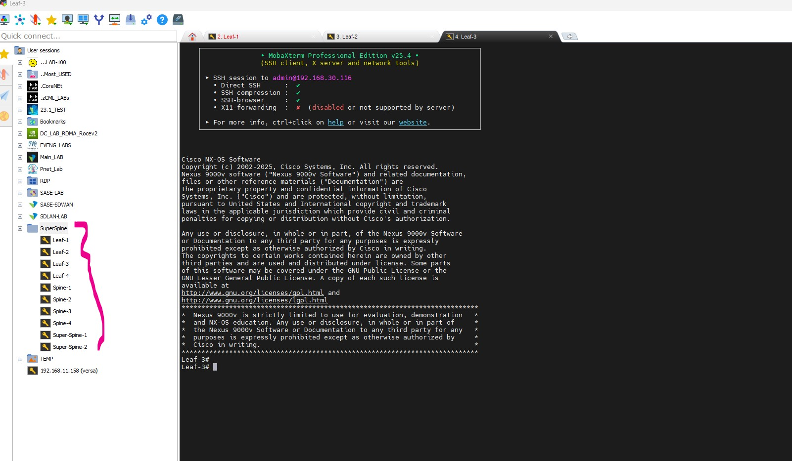

# Cisco CML Lab Automation with AI

Automate Cisco Modeling Labs (CML) device configuration using AI tools (Claude). This project demonstrates how to programmatically configure NX-OS 9000v switches in a **BGP EVPN VXLAN** spine-leaf topology.


## Overview

This repository contains scripts and documentation for:
- Accessing Cisco CML via API and console
- Automated NX-OS device configuration (hostname, management IP, SSH, users)
- **BGP EVPN VXLAN fabric configuration** (3-tier Clos topology)
- MobaXterm session management
- Expect scripts for bulk device provisioning

## Lab Topology

**Architecture:** 3-Tier Clos (Super-Spine / Spine / Leaf)

| Device | Role | Management IP | BGP AS |
|--------|------|---------------|--------|
| Super-Spine-1 | Route Reflector | 192.168.30.118 | 65000 |
| Super-Spine-2 | Route Reflector | 192.168.30.119 | 65000 |
| Spine-1 | Aggregation | 192.168.30.110 | 65001 |
| Spine-2 | Aggregation | 192.168.30.111 | 65002 |
| Spine-3 | Aggregation | 192.168.30.112 | 65003 |
| Spine-4 | Aggregation | 192.168.30.113 | 65004 |
| Leaf-1 | VTEP | 192.168.30.114 | 65101 |
| Leaf-2 | VTEP | 192.168.30.115 | 65102 |
| Leaf-3 | VTEP | 192.168.30.116 | 65103 |
| Leaf-4 | VTEP | 192.168.30.117 | 65104 |

## BGP EVPN VXLAN Design

### IP Addressing Scheme

| Network | Range | Purpose |
|---------|-------|---------|
| Super-Spine Loopbacks | 10.0.0.x/32 | BGP Router-ID |
| Spine Loopbacks | 10.0.1.x/32 | BGP Router-ID |
| Leaf Loopbacks | 10.0.2.x/32 | BGP Router-ID & VTEP Source |
| SS-Spine Links | 10.1.1.x/31 | Point-to-Point |
| Spine-Leaf Links | 10.2.x.y/31 | Point-to-Point |
| VLAN 10 | 192.168.10.0/24 | Data Network |
| VLAN 20 | 192.168.20.0/24 | Voice Network |
| VLAN 30 | 192.168.30.0/24 | Management Network |
| VLAN 40 | 192.168.40.0/24 | Guest Network |

### VNI Mapping

| VLAN | VNI | Purpose |
|------|-----|---------|
| 10 | 10010 | Data (L2VNI) |
| 20 | 10020 | Voice (L2VNI) |
| 30 | 10030 | Management (L2VNI) |
| 40 | 10040 | Guest (L2VNI) |
| 100 | 50000 | VRF mylab (L3VNI) |

### Key Features

- **eBGP Underlay:** Unique ASN per device for multipath
- **eBGP EVPN Overlay:** L2VPN EVPN address-family
- **Anycast Gateway:** Same IP (192.168.x.1) and MAC (0000.1111.2222) on all Leafs
- **VRF:** `mylab` with L3VNI for inter-VLAN routing
- **Ingress Replication:** BGP-based for BUM traffic

## Quick Start

### Prerequisites
- Cisco CML 2.x installed and running
- `expect` package installed (`apt install expect`)
- GitHub CLI (`gh`) for repository management
- MobaXterm (optional, for Windows SSH client)

### 1. Clone Repository
```bash
git clone https://github.com/Enizaksoy/cml-lab-automation.git
cd cml-lab-automation
```

### 2. Apply BGP EVPN VXLAN Configuration

```bash
# Configure Super-Spines
./scripts/config_superspine.exp 192.168.30.118 1
./scripts/config_superspine.exp 192.168.30.119 2

# Configure Spines
./scripts/config_spine.exp 192.168.30.110 1
./scripts/config_spine.exp 192.168.30.111 2
./scripts/config_spine.exp 192.168.30.112 3
./scripts/config_spine.exp 192.168.30.113 4

# Configure Leafs
./scripts/config_leaf.exp 192.168.30.114 1
./scripts/config_leaf.exp 192.168.30.115 2
./scripts/config_leaf.exp 192.168.30.116 3
./scripts/config_leaf.exp 192.168.30.117 4
```

### 3. Verify Configuration
```bash
# On any device
show bgp l2vpn evpn summary
show nve peers
show nve vni
show vxlan
```

## Project Structure

```
cml-lab-automation/
├── README.md
├── images/
│   ├── cml_topology.jpg
│   └── mobaxterm_sessions.jpg
├── scripts/
│   ├── config_superspine.exp    # Super-Spine BGP EVPN config
│   ├── config_spine.exp         # Spine BGP EVPN config
│   └── config_leaf.exp          # Leaf VTEP/VXLAN config
├── configs/
│   ├── 00_design_overview.md    # Design documentation
│   ├── Super-Spine-1.cfg        # Super-Spine-1 configuration
│   ├── Super-Spine-2.cfg        # Super-Spine-2 configuration
│   ├── Spine-1.cfg              # Spine-1 configuration
│   ├── Spine-2.cfg              # Spine-2 configuration
│   ├── Spine-3.cfg              # Spine-3 configuration
│   ├── Spine-4.cfg              # Spine-4 configuration
│   ├── Leaf-1.cfg               # Leaf-1 configuration
│   ├── Leaf-2.cfg               # Leaf-2 configuration
│   ├── Leaf-3.cfg               # Leaf-3 configuration
│   └── Leaf-4.cfg               # Leaf-4 configuration
├── verification/
│   └── BGP_EVPN_VXLAN_Verification.md  # Show command outputs
└── docs/
    └── mobaxterm_setup.md       # MobaXterm configuration guide
```

## Configuration Verification

### Super-Spine-1 BGP Configuration
```
Super-Spine-1# show running-config bgp

router bgp 65000
  router-id 10.0.0.1
  bestpath as-path multipath-relax
  address-family l2vpn evpn
    retain route-target all
  neighbor 10.1.1.1
    remote-as 65001
    description Spine-1
    address-family l2vpn evpn
      send-community extended
      route-map UNCHANGED out
```

### Leaf-1 VXLAN Configuration
```
Leaf-1# show nve vni

Interface VNI      Multicast-group   State Mode Type [BD/VRF]
--------- -------- ----------------- ----- ---- ------------------
nve1      10010    UnicastBGP        Down  CP   L2 [10]
nve1      10020    UnicastBGP        Down  CP   L2 [20]
nve1      10030    UnicastBGP        Down  CP   L2 [30]
nve1      10040    UnicastBGP        Down  CP   L2 [40]
nve1      50000    n/a               Down  CP   L3 [mylab]
```

### Leaf-1 VLAN to VNI Mapping
```
Leaf-1# show vxlan

Vlan            VN-Segment
====            ==========
10              10010
20              10020
30              10030
40              10040
100             50000
```

> **Note:** VNI state shows "Down" because physical links are not yet connected in CML. Once links are created, BGP will establish and VNIs will come up.

## CML Topology Links Required

### Super-Spine to Spine
| From | Interface | To | Interface |
|------|-----------|-----|-----------|
| Super-Spine-1 | E1/1 | Spine-1 | E1/5 |
| Super-Spine-1 | E1/2 | Spine-2 | E1/5 |
| Super-Spine-1 | E1/3 | Spine-3 | E1/5 |
| Super-Spine-1 | E1/4 | Spine-4 | E1/5 |
| Super-Spine-2 | E1/1 | Spine-1 | E1/6 |
| Super-Spine-2 | E1/2 | Spine-2 | E1/6 |
| Super-Spine-2 | E1/3 | Spine-3 | E1/6 |
| Super-Spine-2 | E1/4 | Spine-4 | E1/6 |

### Spine to Leaf
| From | Interface | To | Interface |
|------|-----------|-----|-----------|
| Spine-X | E1/1 | Leaf-1 | E1/X |
| Spine-X | E1/2 | Leaf-2 | E1/X |
| Spine-X | E1/3 | Leaf-3 | E1/X |
| Spine-X | E1/4 | Leaf-4 | E1/X |

## MobaXterm Integration

To add sessions to MobaXterm programmatically:

1. **Close MobaXterm**
2. Edit `%APPDATA%\MobaXterm\MobaXterm.ini`
3. Add bookmark sections (see [MobaXterm Setup Guide](docs/mobaxterm_setup.md))
4. Reopen MobaXterm

### Result: Sessions Created in MobaXterm



*All lab devices organized in a single folder for easy access*

## Using with AI Tools

This workflow was created using Claude (AI assistant). To replicate for your own lab:

### Provide This Information:
```
1. CML Server: IP, username, password
2. Lab Name: Name of your CML lab
3. IP Range: Management IPs for devices (e.g., 192.168.30.110-120)
4. Gateway: Default gateway for management VRF
5. Device Credentials: Username/password to create on devices
6. Fabric Design: VRF name, VLANs, anycast gateway IPs
```

### Example AI Prompt:
```
Configure my CML lab "VXLAN_MANUAL" with BGP EVPN VXLAN:
- 2 Super-Spines, 4 Spines, 4 Leafs
- VRF "mylab" with VLANs 10, 20, 30, 40
- Anycast gateway on leaf switches
- eBGP underlay with unique ASN per device
```

## Troubleshooting

| Issue | Solution |
|-------|----------|
| BGP neighbors in Idle state | Verify physical links are connected in CML topology |
| Cannot SSH to device | Verify device is BOOTED in CML, check `show ip int brief vrf management` |
| NVE VNI showing Down | BGP neighbors not established, check underlay connectivity |
| EVPN routes missing | Verify `nv overlay evpn` feature is enabled |

## Contributing

1. Fork the repository
2. Create a feature branch (`git checkout -b feature/new-topology`)
3. Commit changes (`git commit -am 'Add new topology support'`)
4. Push to branch (`git push origin feature/new-topology`)
5. Open a Pull Request

## License

MIT License - feel free to use and modify for your own labs.

## Author

Created by [Enizaksoy](https://github.com/Enizaksoy) using Claude AI for network automation.

---

**Keywords:** Cisco CML, Network Automation, NX-OS, VXLAN EVPN, BGP, Spine-Leaf, Anycast Gateway, VTEP, Infrastructure as Code, AI-Assisted Automation
